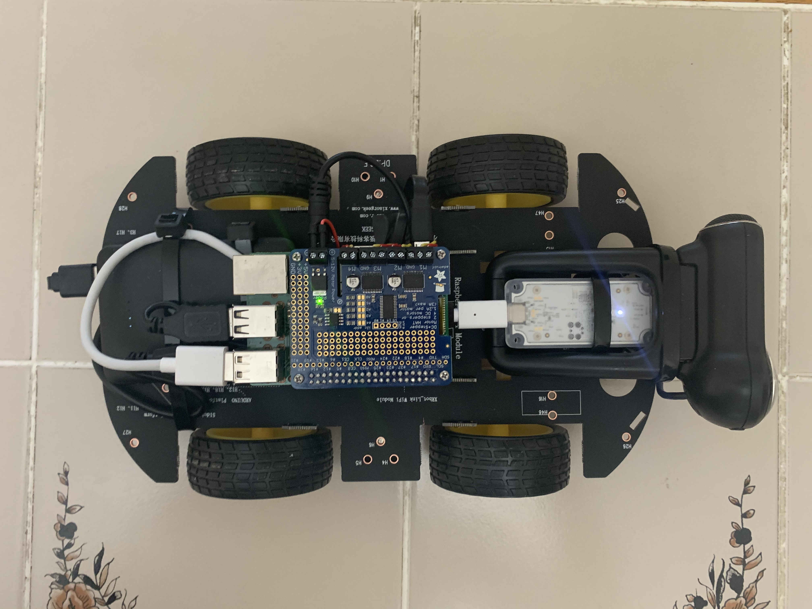
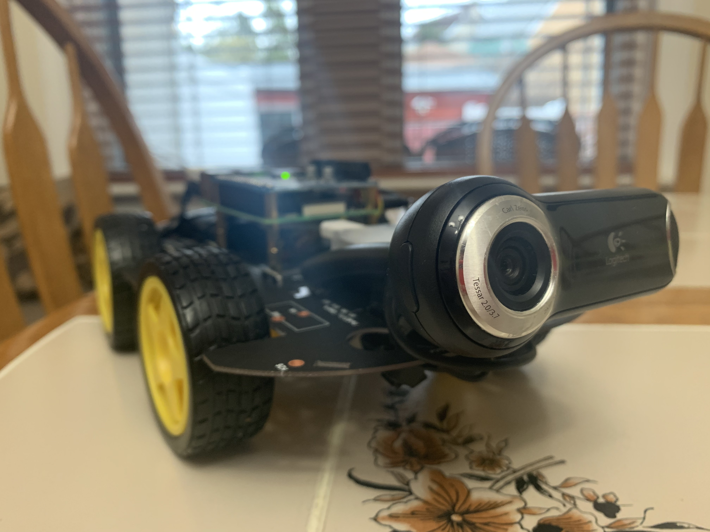

# Autonomous Minicar

Self-driving minicar built on Raspberry Pi and Google Coral.

*Left: Top view, Right: Frontal view showing webcam*

---

## Installing

1. `pip3 install -r requirements.txt`
2. `sudo apt-get install libhdf5-dev -y && sudo apt-get install libhdf5-serial-dev -y && sudo apt-get install libatlas-base-dev -y && sudo apt-get install libjasper-dev -y && sudo apt-get install libqtgui4 -y && sudo apt-get install libqt4-test -y`
3. `cd && wget https://dl.google.com/coral/edgetpu_api/edgetpu_api_latest.tar.gz -O edgetpu_api.tar.gz --trust-server-names`
4. `tar xzf edgetpu_api.tar.gz && cd edgetpu_api/ && bash ./install.sh`, then `y`.
5. `sudo reboot now`

## Running

1. Connect your controller.
2. `python3 main.py`

## Author

Anthony Krivonos – [GitHub](https://www.github.com/anthonykrivonos) | [Portfolio](https://anthonykrivonos.com)

## Thanks To

Yury Shopin for electrical work.

Vicki Shao for creative guidance 🔥